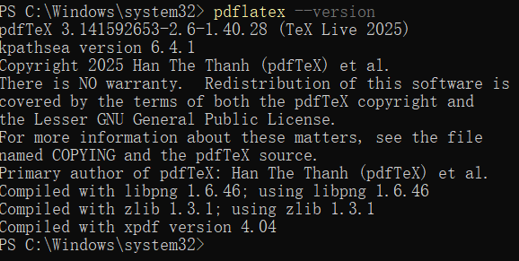
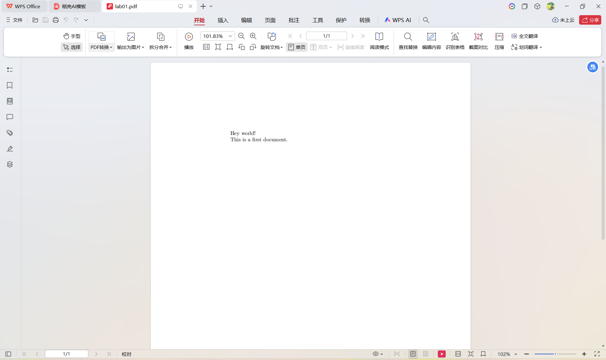

---
## Front matter
title: "Отчёт по лабораторной работе №1"
subtitle: "Computer Skills for Scientific Writing"
author: "Ли Хан"

## Generic otions
lang: ru-RU
toc-title: "Содержание"

## Bibliography
bibliography: bib/cite.bib
csl: pandoc/csl/gost-r-7-0-5-2008-numeric.csl

## Pdf output format
toc: true
toc-depth: 2
lof: true
lot: true
fontsize: 12pt
linestretch: 1.5
papersize: a4
documentclass: scrreprt
## I18n polyglossia
polyglossia-lang:
  name: russian
  options:
    - spelling=modern
    - babelshorthands=true
polyglossia-otherlangs:
  name: english
## I18n babel
babel-lang: russian
babel-otherlangs: english
## Fonts
mainfont: IBM Plex Serif
romanfont: IBM Plex Serif
sansfont: IBM Plex Sans
monofont: IBM Plex Mono
mathfont: STIX Two Math
mainfontoptions: Ligatures=Common,Ligatures=TeX,Scale=0.94
romanfontoptions: Ligatures=Common,Ligatures=TeX,Scale=0.94
sansfontoptions: Ligatures=Common,Ligatures=TeX,Scale=MatchLowercase,Scale=0.94
monofontoptions: Scale=MatchLowercase,Scale=0.94,FakeStretch=0.9
mathfontoptions:
## Biblatex
biblatex: true
biblio-style: "gost-numeric"
biblatexoptions:
  - parentracker=true
  - backend=biber
  - hyperref=auto
  - language=auto
  - autolang=other*
  - citestyle=gost-numeric
## Pandoc-crossref LaTeX customization
figureTitle: "Рис."
tableTitle: "Таблица"
listingTitle: "Листинг"
lofTitle: "Список иллюстраций"
lotTitle: "Список таблиц"
lolTitle: "Листинги"
## Misc options
indent: true
header-includes:
  - \usepackage{indentfirst}
  - \usepackage{float}
  - \floatplacement{figure}{H}
---

# Цель работы

Изучение базовой структуры LaTeX-документа и принципов его компиляции в PDF-файл. В рамках работы рассматриваются создание минимального документа, настройка преамбулы, формирование тела документа, работа с абзацами, комментариями, специальными символами, а также основы структурирования текста и использования математического режима LaTeX.

# Ход выполнения

## Подготовка окружения и проверка установки LaTeX

Перед началом работы была выполнена проверка установленного дистрибутива LaTeX в среде **Windows PowerShell**. Для установки и проверки использовался менеджер пакетов **Chocolatey**, который сообщил, что **TeX Live v2025.20250902.0 уже установлен**. Дополнительно была выполнена команда проверки версии `pdflatex`, подтвердившая использование **pdfTeX (TeX Live 2025)**.

Результат проверки установки и версии `pdflatex` приведён на скриншоте:

## Компиляция первого документа `first.tex`

На следующем этапе был создан исходный файл `first.tex`, содержащий минимальную структуру LaTeX-документа: объявление класса `article`, подключение кодировки шрифтов `T1` с помощью пакета `fontenc`, а также тело документа между командами `\begin{document}` и `\end{document}`.

Компиляция была выполнена командой `pdflatex first.tex`. В выводе компилятора отображается загрузка стандартного класса `article.cls`, файла `size10.clo`, пакета `fontenc.sty` и backend-модуля `l3backend-pdftex.def`. Сообщение `No file first.aux.` указывает на первый запуск компиляции, а запуск `mktexpk` и `METAFONT` связан с генерацией шрифтов.

Вывод компиляции показан на скриншоте:

## Анализ сгенерированного документа `first.pdf`

В результате компиляции был создан PDF-документ, содержащий две строки текста:

- `Hey world!`
- `This is a first document.`

Также автоматически добавлен номер страницы, что является стандартным поведением класса `article`.

Результат отображения PDF-документа показан на скриншоте:

# Вывод

В ходе выполнения задания были успешно изучены и отработаны следующие аспекты работы с LaTeX:

- создание и компиляция минимального LaTeX-документа с использованием класса `article`;
- структура документа LaTeX, включая преамбулу и тело документа;
- использование команд `\begin{document}` и `\end{document}`, а также принцип работы окружений;

