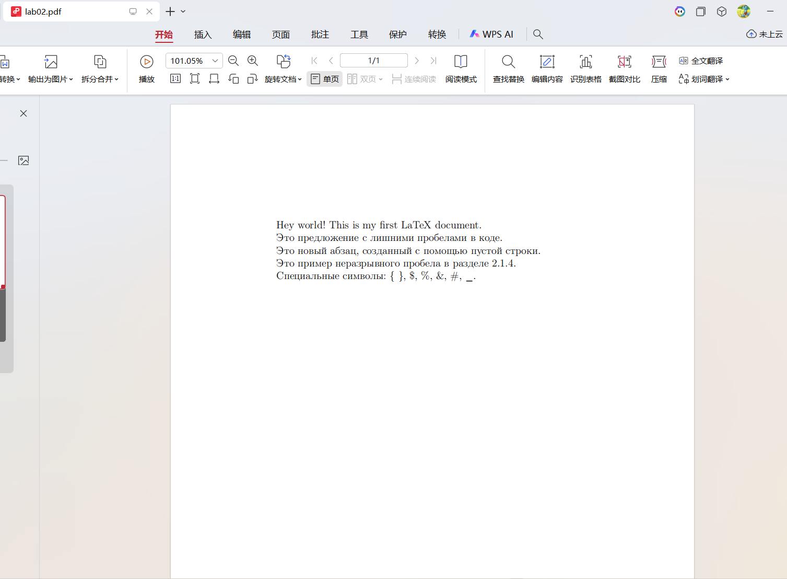

---
## Front matter
lang: ru-RU
title: Лабораторная работа №2
subtitle: структура документа LaTeX
author:
  - Ли Хан
institute:
  - Российский университет дружбы народов, Москва, Россия
date: 09 Марта 2026

## Formatting pdf
toc: false
slide_level: 2
aspectratio: 169
section-titles: true
theme: metropolis
header-includes:
 - \metroset{progressbar=frametitle,sectionpage=progressbar,numbering=fraction}
---

# Цель работы

## Основная цель
Основной целью данной работы является изучение базовых принципов логической структуры документа LaTeX и освоение рабочего процесса создания научных документов

# Ход выполнения

## Среда и инструменты

В ходе работы использовались:

- дистрибутив **TeX Live 2025**;
- компилятор **pdflatex** (pdfTeX);
- стандартный класс документа `article`;
- пакет кодировок `fontenc`.

# Exercise 2.1.4

## Компиляция исходного файла 

Файл `exercise_2_1_4.tex` был скомпилирован командой `pdflatex`.

## Особенности вывода:

Упражнение 1: Демонстрация обработки пробелов. Независимо от количества пробелов между словами в коде, LaTeX воспринимает их как один пробел.

Упражнение 2: Демонстрация разделения на абзацы. В LaTeX разделение на абзацы осуществляется с помощью одной или нескольких пустых строк.

Упражнение 3: Демонстрация неразрывного пробела (тильда). Использование символа ~ гарантирует, что между словами не будет разрыва строки; это часто используется для нумерации или ссылок.

Упражнение 4: Демонстрация экранирования специальных символов \{ \} \$ Если необходимо отобразить такие символы, как \{ \} \$ \%, перед ними нужно поставить обратный слеш.

## код

## Результат компиляции

Полученный документ `exercise_2_1_4.pdf` демонстрирует:

- разбиение текста на абзацы пустыми строками;
- сокращение множественных пробелов до одного;
- влияние неразрывных пробелов (например, в ссылках и инициалах).

## Pdf 

# Итоги работы

## Вывод

На основании проделанной работы можно сделать следующие выводы:

Логическая разметка: В отличие от программ типа Microsoft Word, LaTeX работает по принципу логической разметки, где автор указывает смысл элементов текста, а не их визуальное представление.

Автоматизация форматирования: Система LaTeX эффективно автоматизирует рутинные задачи, такие как обработка множественных пробелов и управление разрывами строк, обеспечивая профессиональное качество типографики.

Гибкость и контроль: Использование специальных символов и механизмов экранирования предоставляет полный контроль над содержимым, хотя и требует строгого соблюдения синтаксиса (например, обязательного наличия парных команд \begin и \end{document}).

