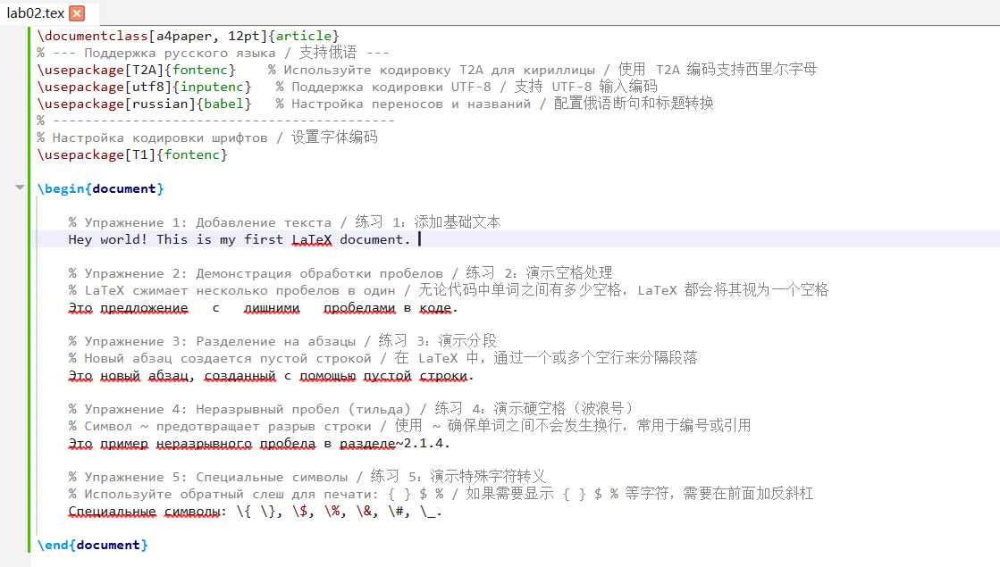

---
## Front matter
title: "Отчёт по лабораторной работе №2"
subtitle: "Computer Skills for Scientific Writing"
author: "Ли Хан"

## Generic otions
lang: ru-RU
toc-title: "Содержание"

## Bibliography
bibliography: bib/cite.bib
csl: pandoc/csl/gost-r-7-0-5-2008-numeric.csl

## Pdf output format
toc: true
toc-depth: 2
lof: true
lot: true
fontsize: 12pt
linestretch: 1.5
papersize: a4
documentclass: scrreprt
## I18n polyglossia
polyglossia-lang:
  name: russian
  options:
    - spelling=modern
    - babelshorthands=true
polyglossia-otherlangs:
  name: english
## I18n babel
babel-lang: russian
babel-otherlangs: english
## Fonts
mainfont: IBM Plex Serif
romanfont: IBM Plex Serif
sansfont: IBM Plex Sans
monofont: IBM Plex Mono
mathfont: STIX Two Math
mainfontoptions: Ligatures=Common,Ligatures=TeX,Scale=0.94
romanfontoptions: Ligatures=Common,Ligatures=TeX,Scale=0.94
sansfontoptions: Ligatures=Common,Ligatures=TeX,Scale=MatchLowercase,Scale=0.94
monofontoptions: Scale=MatchLowercase,Scale=0.94,FakeStretch=0.9
mathfontoptions:
## Biblatex
biblatex: true
biblio-style: "gost-numeric"
biblatexoptions:
  - parentracker=true
  - backend=biber
  - hyperref=auto
  - language=auto
  - autolang=other*
  - citestyle=gost-numeric
## Pandoc-crossref LaTeX customization
figureTitle: "Рис."
tableTitle: "Таблица"
listingTitle: "Листинг"
lofTitle: "Список иллюстраций"
lotTitle: "Список таблиц"
lolTitle: "Листинги"
## Misc options
indent: true
header-includes:
  - \usepackage{indentfirst}
  - \usepackage{float}
  - \floatplacement{figure}{H}
---

# Цель работы

Основной целью данной работы является изучение базовых принципов логической структуры документа LaTeX и освоение рабочего процесса создания научных документов

# Ход выполнения

## Компиляция и проверка файла `exercise_2_1_4.tex`

Упражнение 1: Демонстрация обработки пробелов. Независимо от количества пробелов между словами в коде, LaTeX воспринимает их как один пробел.

Упражнение 2: Демонстрация разделения на абзацы. В LaTeX разделение на абзацы осуществляется с помощью одной или нескольких пустых строк.

Упражнение 3: Демонстрация неразрывного пробела (тильда). Использование символа ~ гарантирует, что между словами не будет разрыва строки; это часто используется для нумерации или ссылок.

Упражнение 4: Демонстрация экранирования специальных символов \{ \} \$ Если необходимо отобразить такие символы, как \{ \} \$ \%, перед ними нужно поставить обратный слеш.

Результат выполнения компиляции представлен на скриншоте:

## Визуальный результат представлен на скриншоте:

Полученный документ `exercise_2_1_4.pdf` демонстрирует:

- разбиение текста на абзацы пустыми строками;
- сокращение множественных пробелов до одного;
- влияние неразрывных пробелов (например, в ссылках и инициалах).

# Вывод

На основании проделанной работы можно сделать следующие выводы:

Логическая разметка: В отличие от программ типа Microsoft Word, LaTeX работает по принципу логической разметки, где автор указывает смысл элементов текста, а не их визуальное представление.

Автоматизация форматирования: Система LaTeX эффективно автоматизирует рутинные задачи, такие как обработка множественных пробелов и управление разрывами строк, обеспечивая профессиональное качество типографики.

Гибкость и контроль: Использование специальных символов и механизмов экранирования предоставляет полный контроль над содержимым, хотя и требует строгого соблюдения синтаксиса (например, обязательного наличия парных команд \begin и \end{document}).