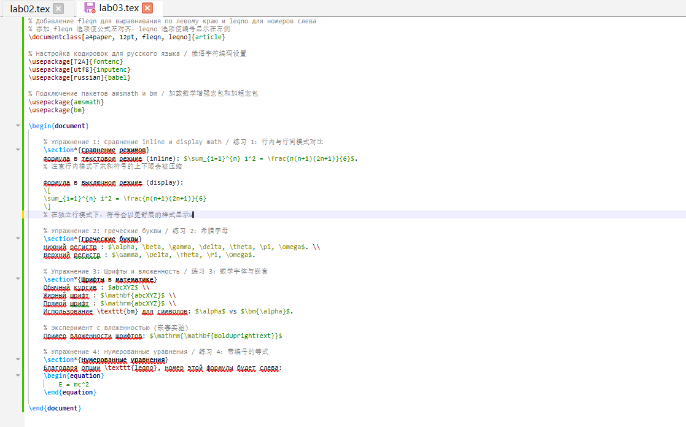
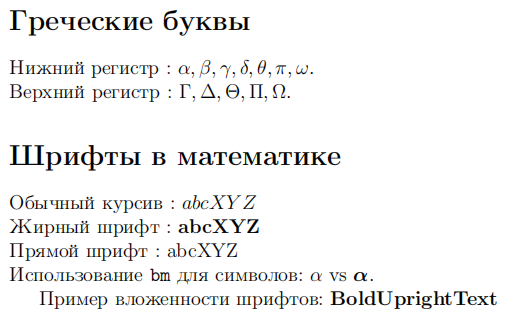
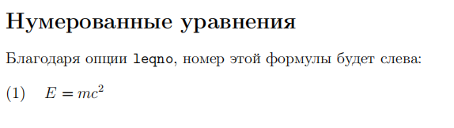

---
## Front matter
lang: ru-RU
title: Лабораторная работа №3
subtitle: Математический режим LaTeX
author:
  - Ли Хан
institute:
  - Российский университет дружбы народов, Москва, Россия
date: 2026

## Formatting pdf
toc: false
slide_level: 2
aspectratio: 169
section-titles: true
theme: metropolis
header-includes:
 - \metroset{progressbar=frametitle,sectionpage=progressbar,numbering=fraction}
---

# Цель работы

## Основная цель

Изучение математического режима LaTeX, включая встроенные и отображаемые формулы, использование пакета `amsmath`, управление выравниванием и нумерацией уравнений, а также применение различных математических шрифтов.

# Exercise 3.8

## Компиляция исходного файла

Файл `exercise_3_8.tex` был открыт в текстовом редакторе и скомпилирован с помощью команды `pdflatex`.

Использовались:
- TeX Live 2025  
- класс документа `article`  
- пакет `amsmath`

## Компиляция exercise_3_8.tex

## Полученный результат

В ходе работы я протестировал два режима отображения:

- Inline (строчный): Формулы внутри текста (например, $\sum_{i=1}^{n}$) выглядят компактно, пределы знака суммы располагаются сбоку.
- Display (выключной): Формулы на отдельной строке (например,$$ \sum_{i=1}^{n} $$) выглядят крупнее, пределы отображаются над и под символом.

## Результат Exercise 3.8

## Греческие буквы и шрифты

Я изучил способы выделения символов жирным шрифтом:

- Команда  `\mathbf`  делает буквы жирными и прямыми, но не работает для греческих символов.

- Команда `\bm`  из пакета bm позволяет сделать жирным любой символ, включая греческие буквы.

- Команда `\boldmath` перед формулой делает жирным всё выражение целиком.

## Греческие буквы и шрифты

# Опции leqno

leqno: Номера формул переместились с привычного правого края на левый край страницы.

Эти настройки полезны для изменения стандартного макета отчета.

## Опции leqno

# Итоги работы

## Вывод

Выполнение упражнений показало, что LaTeX предоставляет очень гибкие инструменты для набора математики. Главное отличие от обычных редакторов — это возможность логически управлять отображением формул (строчные или выносные) и легко менять глобальный стиль оформления всего документа через простые опции класса.
