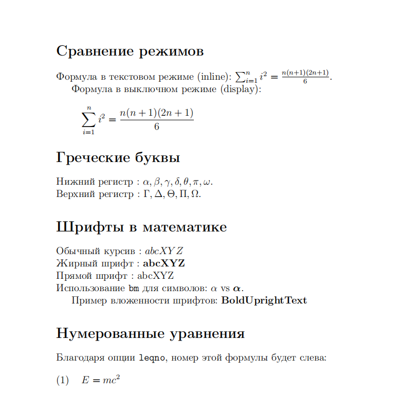

---
## Front matter
title: "Отчёт по лабораторной работе №3"
subtitle: "Computer Skills for Scientific Writing"
author: "Ли Хан"

## Generic otions
lang: ru-RU
toc-title: "Содержание"

## Bibliography
bibliography: bib/cite.bib
csl: pandoc/csl/gost-r-7-0-5-2008-numeric.csl

## Pdf output format
toc: true
toc-depth: 2
lof: true
lot: true
fontsize: 12pt
linestretch: 1.5
papersize: a4
documentclass: scrreprt
## I18n polyglossia
polyglossia-lang:
  name: russian
  options:
    - spelling=modern
    - babelshorthands=true
polyglossia-otherlangs:
  name: english
## I18n babel
babel-lang: russian
babel-otherlangs: english
## Fonts
mainfont: IBM Plex Serif
romanfont: IBM Plex Serif
sansfont: IBM Plex Sans
monofont: IBM Plex Mono
mathfont: STIX Two Math
mainfontoptions: Ligatures=Common,Ligatures=TeX,Scale=0.94
romanfontoptions: Ligatures=Common,Ligatures=TeX,Scale=0.94
sansfontoptions: Ligatures=Common,Ligatures=TeX,Scale=MatchLowercase,Scale=0.94
monofontoptions: Scale=MatchLowercase,Scale=0.94,FakeStretch=0.9
mathfontoptions:
## Biblatex
biblatex: true
biblio-style: "gost-numeric"
biblatexoptions:
  - parentracker=true
  - backend=biber
  - hyperref=auto
  - language=auto
  - autolang=other*
  - citestyle=gost-numeric
## Pandoc-crossref LaTeX customization
figureTitle: "Рис."
tableTitle: "Таблица"
listingTitle: "Листинг"
lofTitle: "Список иллюстраций"
lotTitle: "Список таблиц"
lolTitle: "Листинги"
## Misc options
indent: true
header-includes:
  - \usepackage{indentfirst}
  - \usepackage{float}
  - \floatplacement{figure}{H}
---

# Цель работы

Изучение возможностей математического режима LaTeX, включая встроенные и отображаемые формулы, использование пакета `amsmath`, управление выравниванием и нумерацией уравнений, а также применение различных математических шрифтов и обозначений.

# Ход выполнения

## Компиляция и проверка задания *Exercise 3.8*

На первом этапе был открыт исходный файл `lab03` с помощью текстового редактора и выполнена его компиляция командой `pdflatex`.

В процессе компиляции использовался дистрибутив **TeX Live 2025** и стандартный класс документа `article` с подключённым пакетом `amsmath`. В выводе компилятора отображается загрузка дополнительных пакетов для работы с математикой и шрифтами, включая `bm`.

Результат выполнения команды `lab03.tex` показан на скриншоте:

## Анализ сгенерированного документа *Exercise 3.8*

Сформированный PDF-файл содержит несколько тематических разделов, демонстрирующих расширенные возможности математического режима LaTeX.

В документе представлены следующие элементы:

- Режимы отображения:

  - Inline (строчный): Математические символы внутри текстовой строки, например ($\sum_{i=1}^{n}$).

  - Display (выключной): Выделенные формулы на отдельной строке, например (например,$$ \sum_{i=1}^{n} $$).

- Математические шрифты:
  - `\mathbf`: Команда для создания прямого жирного начертания (используется как `$\mathbf{abc}$`).

  - `\mathrm`: Команда для набора текста прямым шрифтом внутри формул.

  - `\mathit`: Команда для набора текста математическим курсивом.

## Компиляция варианта с опциями `leqno`

Далее был открыт файл `lab03.tex`, в котором используются дополнительные опции класса документа:

- `leqno` — размещение номеров формул слева.

Выполнена компиляция файла командой `lab03.tex`.

В документе:

- формулы выровнены по левому краю страницы;
- номера уравнений располагаются слева от формул;
- показаны как одиночные уравнения, так и система уравнений с последовательной нумерацией.

# Вывод

В ходе выполнения задания были успешно изучены и протестированы:

- inline и display математический режим LaTeX;
- возможности пакета **amsmath** для выравнивания и многострочных формул;
- управление шрифтами и жирным начертанием в математике;
- влияние опций `leqno` на форматирование формул.

Все файлы были корректно скомпилированы, а результаты соответствуют ожидаемому поведению математического набора LaTeX.
