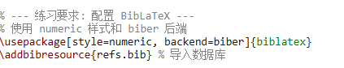
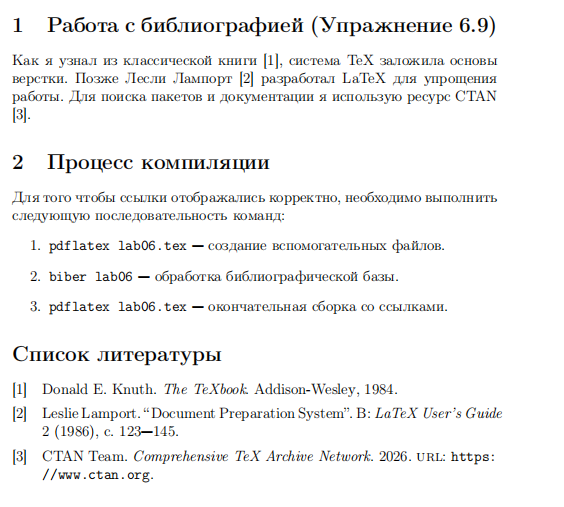
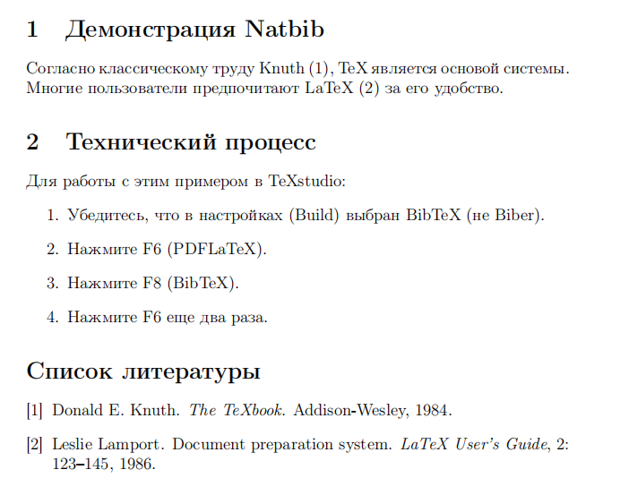
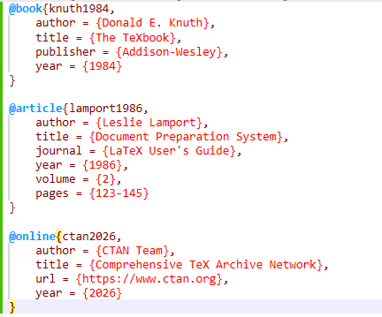
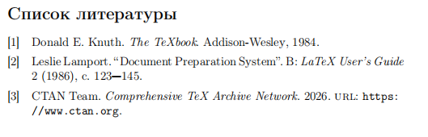
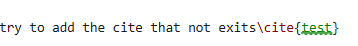
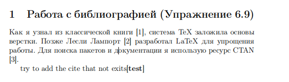

---
## Front matter
lang: ru-RU
title: Лабораторная работа №6
subtitle: Работа с библиографией в LaTeX natbib и biblatex
author:
  - Ли Хан
institute:
  - Российский университет дружбы народов, Москва, Россия
date: 11 Марта 2026

## Formatting pdf
toc: false
slide_level: 2
aspectratio: 169
section-titles: true
theme: metropolis
header-includes:
 - \metroset{progressbar=frametitle,sectionpage=progressbar,numbering=fraction}
---

# Цель работы

## Основная цель

Изучить работу систем библиографии **natbib** и **biblatex**,  
освоить полный цикл генерации ссылок через **BibTeX** и **Biber**,  
добавлять новые записи в `.bib` и анализировать корректность ссылок.

# Сравнительный анализ систем

В ходе выполнения упражнений были изучены две основные системы управления библиографией: natbib и biblatex. Установлено, что biblatex является более современным инструментом, поддерживающим широкий спектр типов данных и кодировку UTF-8 через процессор biber.

# BibTeX

## Настройки компилятора

## Настройки компилятора

## Результат bibТex

# Natbib

## Настройки компилятора

## Настройки компилятора

## Пример natbib_example

## Создание новых записей и цитирование

Я успешно реализовал процесс расширения базы данных. Для этого я вручную добавил в файл `refs.bib` новые типы источников: `article` и `online`. Я присвоил каждой записи уникальный ключ, который затем использовал в тексте документа через команду `\cite`. Это позволило мне автоматизировать процесс формирования списка литературы и гарантировать, что все данные об источнике будут отображены в едином стиле.

## refs.bib

## результат

## добавить несуществующую ссылку

Я попытался добавить несуществующую ссылку, и в итоге получился следующий результат.

## результат

Это просто отображает цитируемый текст, не имеющий никакого смысла.

## Роль параметра `style=numeric`

Параметр `style=numeric` определяет визуальное представление ссылок в документе. В тексте он заменяет полные данные об источнике на краткий индекс в квадратных скобках, например `[1]`. В списке литературы он автоматически генерирует нумерованный перечень. Это позволяет сделать текст более лаконичным, не перегружая его именами авторов, что особенно важно для технических и научных работ.

## код

## результат

# Выводы

## Итоги работы

В ходе лабораторной работы были освоены:

- компиляция документа с использованием **natbib** и **biblatex**;
- работа с **BibTeX** и **Biber**;
- добавление новых записей в `.bib`;
- анализ корректных и отсутствующих цитат;
- сравнение стилей выводов ссылок, включая `numeric`.

В ходе выполнения лабораторной работы №6 были изучены современные стандарты оформления библиографии в системе LaTeX.