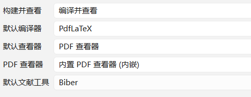
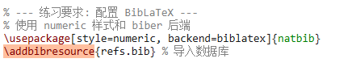
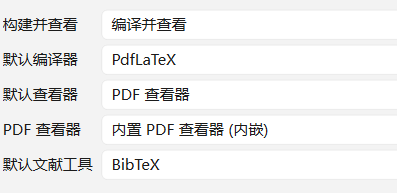

---
## Front matter
title: "Отчёт по лабораторной работе №6"
subtitle: "Computer Skills for Scientific Writing"
author: "Ли Хан"

## Generic otions
lang: ru-RU
toc-title: "Содержание"

## Bibliography
bibliography: bib/cite.bib
csl: pandoc/csl/gost-r-7-0-5-2008-numeric.csl

## Pdf output format
toc: true
toc-depth: 2
lof: true
lot: true
fontsize: 12pt
linestretch: 1.5
papersize: a4
documentclass: scrreprt
## I18n polyglossia
polyglossia-lang:
  name: russian
  options:
    - spelling=modern
    - babelshorthands=true
polyglossia-otherlangs:
  name: english
## I18n babel
babel-lang: russian
babel-otherlangs: english
## Fonts
mainfont: IBM Plex Serif
romanfont: IBM Plex Serif
sansfont: IBM Plex Sans
monofont: IBM Plex Mono
mathfont: STIX Two Math
mainfontoptions: Ligatures=Common,Ligatures=TeX,Scale=0.94
romanfontoptions: Ligatures=Common,Ligatures=TeX,Scale=0.94
sansfontoptions: Ligatures=Common,Ligatures=TeX,Scale=MatchLowercase,Scale=0.94
monofontoptions: Scale=MatchLowercase,Scale=0.94,FakeStretch=0.9
mathfontoptions:
## Biblatex
biblatex: true
biblio-style: "gost-numeric"
biblatexoptions:
  - parentracker=true
  - backend=biber
  - hyperref=auto
  - language=auto
  - autolang=other*
  - citestyle=gost-numeric
## Pandoc-crossref LaTeX customization
figureTitle: "Рис."
tableTitle: "Таблица"
listingTitle: "Листинг"
lofTitle: "Список иллюстраций"
lotTitle: "Список таблиц"
lolTitle: "Листинги"
## Misc options
indent: true
header-includes:
  - \usepackage{indentfirst}
  - \usepackage{float}
  - \floatplacement{figure}{H}
---

# Цель работы

Изучение методов автоматизации создания списков литературы и управления цитированием в системе LaTeX. Отработка навыков работы с пакетами `natbib` и `biblatex`, а также понимание различий между процессорами `BibTeX` и `Biber`.

# Сравнение систем Natbib и BibLaTeX

В ходе упражнения были реализованы два подхода к управлению библиографией.

Анализ: Пакет `natbib` является классическим инструментом, ориентированным на работу с процессором `BibTeX`. Он надежен, но ограничен в поддержке современных кодировок и типов данных. Пакет `biblatex` с бэкендом `biber` представляет собой современную альтернативу, предлагающую полную поддержку `UTF-8` и более гибкую настройку стилей через параметры макропакета.

## BibLaTeX

## Natbib 

# Добавление новых записей и ссылок

Была создана внешняя база данных в формате `.bib`, в которую были добавлены источники различных типов `(book, article, online)`.

Анализ: Использование уникальных ключей цитирования позволяет отделить содержание документа от библиографических данных. Это гарантирует согласованность данных: при изменении информации в одном `.bib` файле она автоматически обновляется во всех местах цитирования в документе.

## refs.bib

## результат

# добавить несуществующую ссылку

В рамках данного модуля в текст документа была намеренно вставлена команда `\cite{test}`, где `test` — это идентификатор, который отсутствует в базе данных `.bib`. Целью эксперимента было изучение реакции компилятора и системы связей на нарушение целостности данных.

## код

## результат

Это просто отображает цитируемый текст, не имеющий никакого смысла.

# Эксперименты со стилями (numeric)

Проведено тестирование опции `style=numeric` для обоих пакетов.

Анализ: Данный стиль заменяет текстовые ссылки (автор, год) на компактные цифровые индексы в квадратных скобках. Это существенно упрощает чтение технических текстов. Было замечено, что в `biblatex` смена стиля оформления происходит проще — путем изменения всего одного параметра в преамбуле документа.

## код

## результат

# Вывод

В ходе выполнения лабораторной работы №6 был проведен комплексный анализ механизмов управления библиографией в системе LaTeX. Итоговые результаты работы можно разделить на следующие ключевые этапы:

- Сравнительный анализ систем: Проведено практическое сравнение классического пакета `natbib` и современного `biblatex`. Установлено, что `biblatex` в сочетании с процессором biber обеспечивает более гибкое управление данными и лучшую поддержку современных форматов.

- Управление базами данных: Создан и протестирован внешний файл `.bib`. Отработан навык добавления различных типов записей (книга, статья, интернет-ресурс) и их вызова через уникальные ключи цитирования.

- Контроль ссылок и диагностика: Проведен эксперимент по добавлению несуществующих ссылок. Проанализирована реакция компилятора (предупреждения) и визуальные индикаторы в PDF, что позволило освоить методы отладки документа.

- Стилизация и автоматизация: Протестированы цифровые стили оформления (numeric). Отработана последовательность команд для корректной сборки проекта: pdflatex -> biber -> pdflatex.

