# Цель работы

## Основная цель

Изучить приёмы создания презентаций в LaTeX с использованием класса **beamer**,  
включая:

- структуру слайдов;
- работу с блоками (`block`, `exampleblock`);
- пошаговое раскрытие элементов с `\pause`;
- точное управление отображением через `\uncover`;

# Структура презентации в Beamer

## Создание титульной страницы: 

Я начал работу с настройки метаданных документа, таких как `\title`, `\author` и `\institute`. С помощью команды `\titlepage` внутри первого окружения frame я сформировал профессиональный титульный лист, который автоматически адаптируется под выбранную тему оформления.

## код

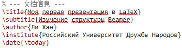

## полученный результат

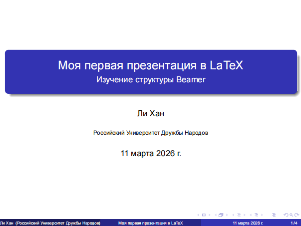

## Организация оглавления: 

Для обеспечения удобной навигации по докладу я создал отдельный слайд с командой `\tableofcontents`. Я заметил, что Beamer автоматически собирает названия всех разделов `\section`, что значительно упрощает логическое структурирование материала.

## код

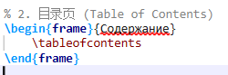

## полученный результат

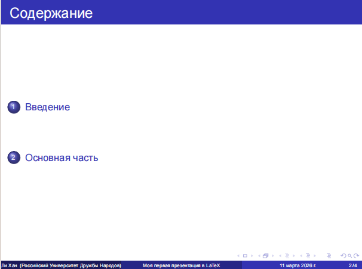

## Разработка обычных контентных страниц:

Я освоил создание стандартных кадров для передачи текстовой информации. В рамках упражнения я наполнил страницы маркированными списками `itemize`, что позволило мне наглядно представить основные тезисы работы.

## код

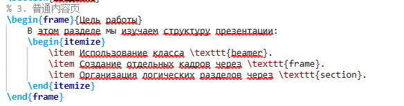

## полученный результат

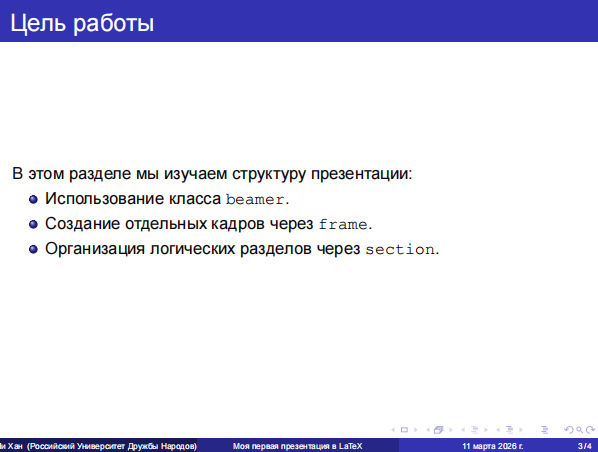

## Использование блоков выделения:

Для акцентирования внимания на ключевых моментах я интегрировал специальные окружения block и alertblock. Это позволило мне визуально отделить важные определения и предупреждения от основного текста, улучшая восприятие презентации аудиторией.

## код

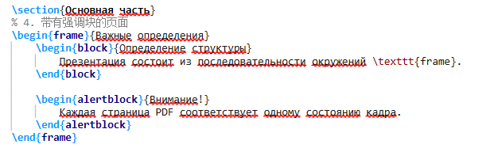

## полученный результат

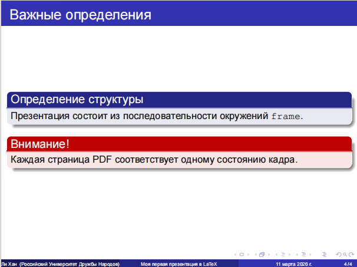

# Pause

Реализация пошагового вывода: В ходе упражнения я освоил использование команды `\pause` для управления динамикой презентации. Я применил эту команду внутри окружения `itemize`, что позволило мне выводить пункты списка последовательно.

## код

# полученный результат

## Начальный интерфейс

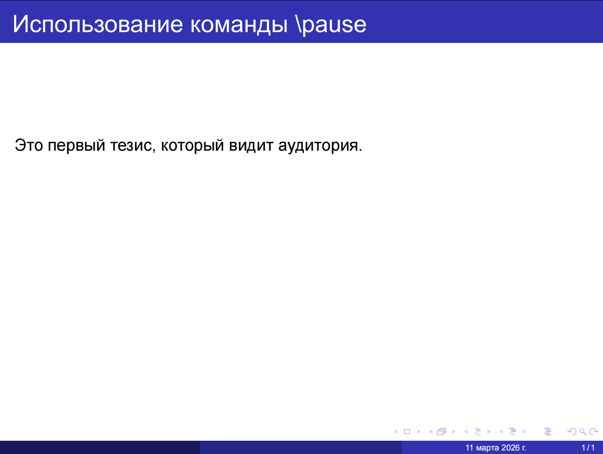

## Первый клик

## Второй клик

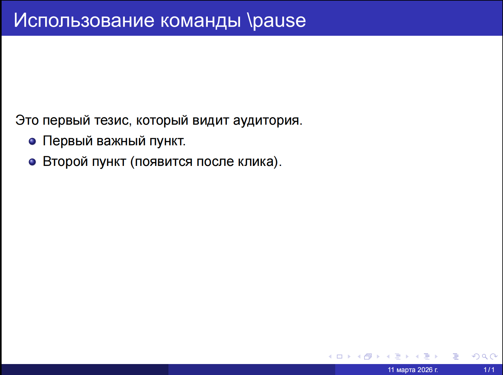

## Третий клик

## Последний клик

# Гибкое управление оверлеями с `\textbackslash` uncover

Я изучил команду `\uncover`, которая позволяет более точно настраивать моменты появления объектов. В отличие от `\pause`, эта команда резервирует место под текст, что предотвращает нежелательные скачки элементов на слайде при их постепенном выводе.

Эксперимент показал, что `\uncover` делает презентацию более профессиональной за счет стабильного расположения заголовков и графики, независимо от текущего шага анимации.

## код

# полученный результат

## Первый клик

## второй клик

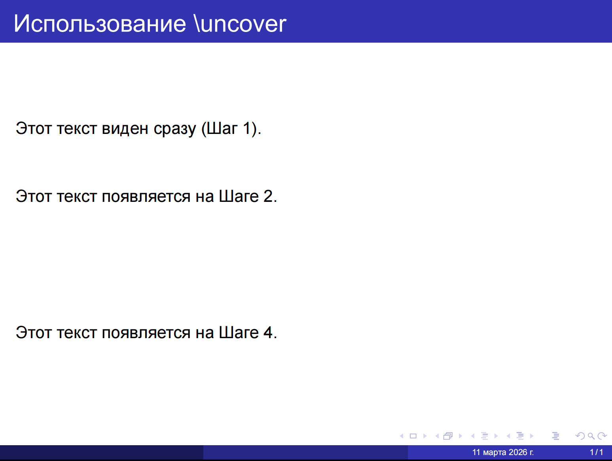

# Выводы

## Итоги работы

В ходе лабораторной работы были освоены:

- Освоение структуры презентации: Я научился формировать логический каркас доклада, включая автоматическую генерацию титульного листа `\titlepage`, оглавления `\tableofcontents` и навигационных разделов `\section`.

- Реализация динамических эффектов:

  - С помощью команды `\pause` я реализовал простейший механизм поэтапного вывода информации.

  - С помощью команды `\uncover` и спецификаций оверлеев. я научился создавать сложные анимации с сохранением макета страницы , что исключает «прыгание» текста при переключении слайдов