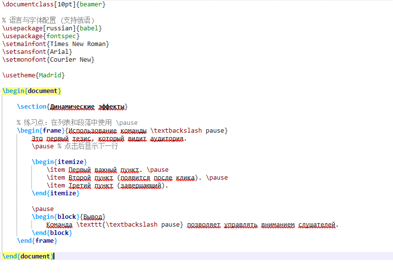
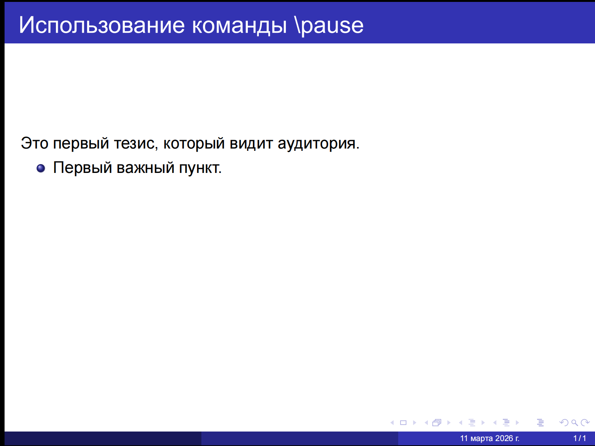
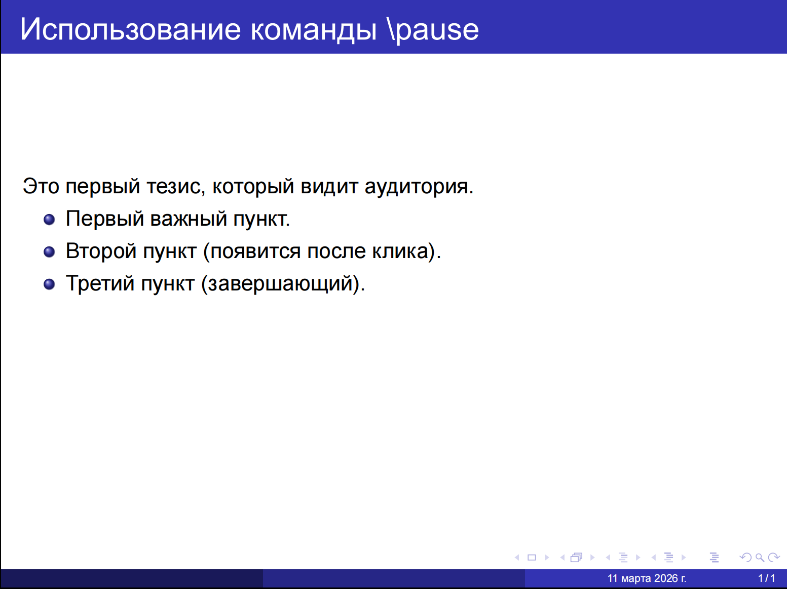
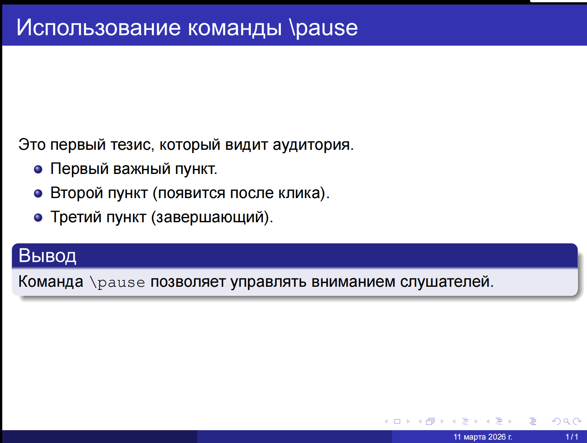
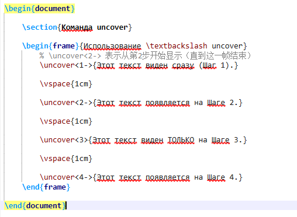
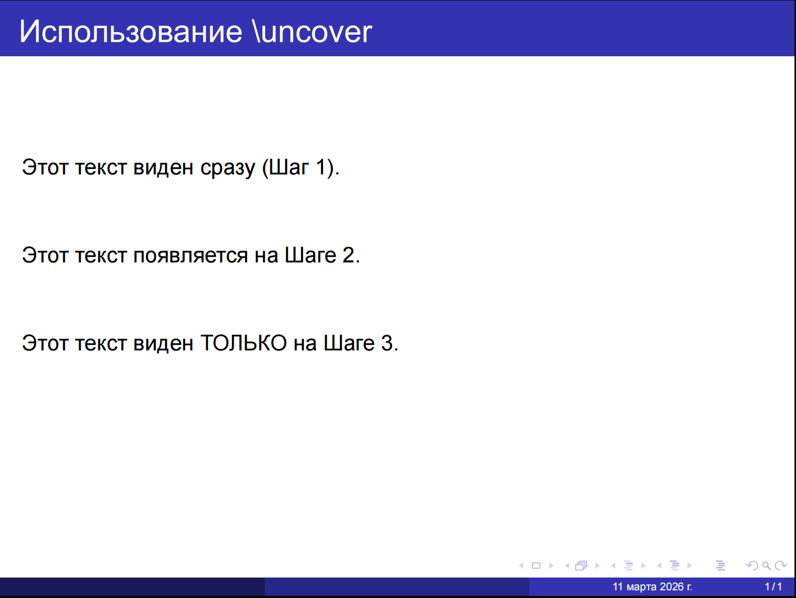

---
## Front matter
title: "Отчёт по лабораторной работе №7"
subtitle: "Computer Skills for Scientific Writing"
author: "Ли Хан"

## Generic otions
lang: ru-RU
toc-title: "Содержание"

## Bibliography
bibliography: bib/cite.bib
csl: pandoc/csl/gost-r-7-0-5-2008-numeric.csl

## Pdf output format
toc: true
toc-depth: 2
lof: true
lot: true
fontsize: 12pt
linestretch: 1.5
papersize: a4
documentclass: scrreprt
## I18n polyglossia
polyglossia-lang:
  name: russian
  options:
    - spelling=modern
    - babelshorthands=true
polyglossia-otherlangs:
  name: english
## I18n babel
babel-lang: russian
babel-otherlangs: english
## Fonts
mainfont: IBM Plex Serif
romanfont: IBM Plex Serif
sansfont: IBM Plex Sans
monofont: IBM Plex Mono
mathfont: STIX Two Math
mainfontoptions: Ligatures=Common,Ligatures=TeX,Scale=0.94
romanfontoptions: Ligatures=Common,Ligatures=TeX,Scale=0.94
sansfontoptions: Ligatures=Common,Ligatures=TeX,Scale=MatchLowercase,Scale=0.94
monofontoptions: Scale=MatchLowercase,Scale=0.94,FakeStretch=0.9
mathfontoptions:
## Biblatex
biblatex: true
biblio-style: "gost-numeric"
biblatexoptions:
  - parentracker=true
  - backend=biber
  - hyperref=auto
  - language=auto
  - autolang=other*
  - citestyle=gost-numeric
## Pandoc-crossref LaTeX customization
figureTitle: "Рис."
tableTitle: "Таблица"
listingTitle: "Листинг"
lofTitle: "Список иллюстраций"
lotTitle: "Список таблиц"
lolTitle: "Листинги"
## Misc options
indent: true
header-includes:
  - \usepackage{indentfirst}
  - \usepackage{float}
  - \floatplacement{figure}{H}
---

# Цель работы

Изучить основные приёмы создания презентаций в LaTeX с использованием класса **beamer**. Освоить процесс компиляции различных примеров, демонстрирующих базовую структуру презентации, работу с блоками, пошаговое отображение элементов с помощью `\pause`, управление порядком появления объектов с использованием `\uncover`, а также изменение оформления через темы и цветовые схемы.

# Ход выполнения

## Структура презентации в Beamer

Описание: Сформирован базовый каркас документа с использованием команды `\titlepage` для титульного листа и `\tableofcontents` для автоматического оглавления.

Анализ: Установлено, что Beamer автоматически синхронизирует структуру разделов `\section` с навигационными панелями и оглавлением, обеспечивая строгую логику документа.

## код

## полученный результат

## Разработка обычных контентных страниц

Описание: Созданы стандартные кадры `frame`, содержащие текст и маркированные списки `itemize`.

Анализ: Для визуального акцентирования использованы блоки `block` и `alertblock`. Это позволило эффективно отделить определения и важные тезисы от основного текста, улучшая восприятие слайда.

## код

## полученный результат

## Использование команды `\textbackslash` pause

Описание: В списки и текстовые блоки вставлена команда `\pause` для создания эффекта пошагового появления контента.

Анализ: Выявлено, что `\pause` разделяет одну логическую страницу на несколько физических страниц PDF. Это простейший способ управления вниманием аудитории во время выступления.

## Управление оверлеями через `\textbackslash` uncover

Описание: Реализован вывод текста с использованием спецификаций `<1->`, `<2->` и команды `\uncover`.

Анализ: В отличие от `\pause`, команда `\uncover` заранее резервирует место под скрытый текст. Это исключает «прыгание» элементов и гарантирует стабильность макета при переключении этапов анимации.

# Вывод

В ходе работы освоены основные инструменты beamer.

- Результат 1: Научился создавать структурированные презентации с автоматической навигацией.

- Результат 2: Отработал навыки использования визуальных блоков для выделения ключевой информации.

- Результат 3: Освоил методы динамического вывода данных (`pause` и `uncover`), позволяющие контролировать темп подачи материал

Использование LaTeX для презентаций признано эффективным благодаря идеальной интеграции с математическим текстом и профессиональному качеству верстки.
