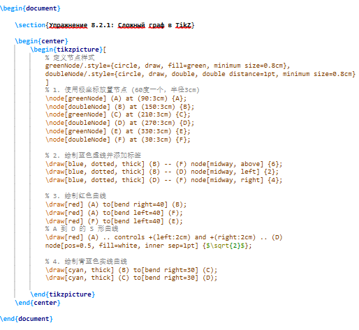
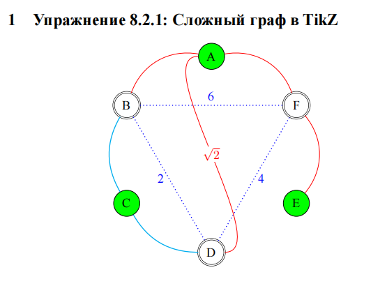
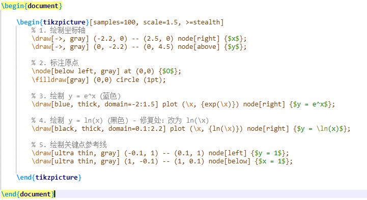
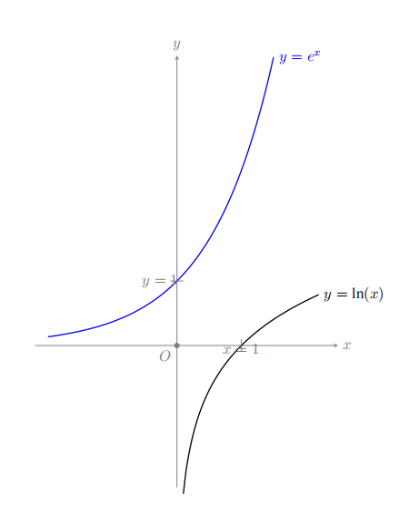
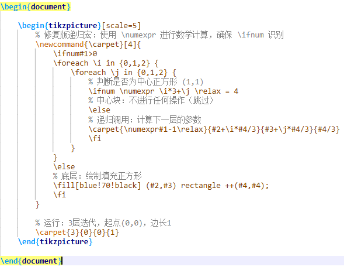

---
## Front matter
lang: ru-RU
title: Лабораторная работа №8
subtitle: Diagrams and drawings as code (TikZ)
author:
  - Ли Хан
institute:
  - Российский университет дружбы народов, Москва, Россия
date: 11 Марта 2025

## Formatting pdf
toc: false
slide_level: 2
aspectratio: 169
section-titles: true
theme: metropolis
header-includes:
 - \metroset{progressbar=frametitle,sectionpage=progressbar,numbering=fraction}
---

# Цель работы

## Основная цель

Изучение возможностей пакета **TikZ** для создания графических объектов в LaTeX, включая построение графов, графиков функций и фрактальных структур, а также освоение принципов описания изображений в виде кода.

# Exercise 8.2.1 — Graph

## Геометрическое построение:

В этом упражнении я реализовал симметричный граф из шести узлов. Для их размещения я использовал полярные координаты `angle:radius`, что позволило мне идеально распределить элементы A–F по кругу с шагом в 60 градусов.

## код

## Полученный результат

В результате компиляции был сформирован PDF-документ, содержащий граф с узлами и взвешенными рёбрами.

Особенности графа:
- узлы оформлены в виде окружностей;
- рёбра соединяют внешние и внутренние вершины;
- веса рёбер подписаны непосредственно на линиях.

## результат

# Exercise 8.2.2 — Plot

## Построение графиков функций

Визуализация математических функций: В рамках второго упражнения я реализовал графики экспоненциальной функции y = e^x и логарифмической функции y = ln(x).

Настройка точности: С помощью параметра `samples=100` я добился высокой плавности кривых. Особое внимание было уделено настройке области определения `domain` для логарифма, чтобы избежать математических ошибок при компиляции.

## код

## Построение графиков функций

В итоговом PDF-документе представлены:

- оси координат с подписями;
- график функции y = e^x;
- график функции y = ln(x);
- вспомогательные линии x = 1 и y = 1.

Каждый элемент выделен цветом и снабжён текстовой подписью.

## результат

# Exercise 8.2.3 — Sierpinski Carpet

## Компиляция

На основе примера с треугольником Серпинского я разработал рекурсивный алгоритм для генерации "ковра". Основная сложность заключалась в правильном делении квадрата на 9 секторов и исключении центрального сегмента на каждой итерации.

Я использовал вложенные циклы `\foreach` и условные операторы `\ifnum`для управления процессом рекурсии. Это позволило автоматизировать отрисовку восьми самоподобных копий внутри каждого родительского квадрата.

## код

## Фрактальная структура

В результате был построен фрактал **ковёр Серпинского**, полученный путём итеративного удаления центральных квадратов.

Особенности реализации:
- повторяющиеся геометрические элементы;
- строгая симметрия;
- масштабирование базовой фигуры.

## результат

# Итоги работы

## Вывод

В ходе лабораторной работы были освоены:

- основы работы с пакетом `tikz`;
- построение графов с узлами и рёбрами;
- визуализация математических функций;
- добавление осей, подписей и вспомогательных элементов;
- создание сложных итеративных структур на примере фракталов.

Пакет **TikZ** позволяет эффективно создавать качественные и воспроизводимые графические объекты непосредственно в LaTeX-документах.
