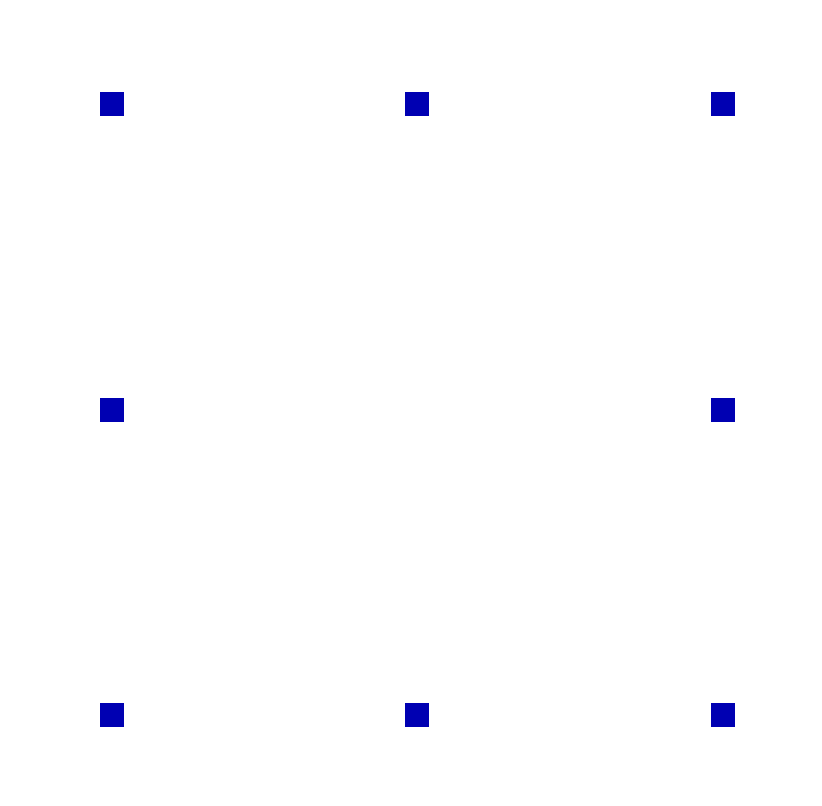

---
## Front matter
title: "Отчёт по лабораторной работе №8"
subtitle: "Computer Skills for Scientific Writing"
author: "Ли Хан"

## Generic otions
lang: ru-RU
toc-title: "Содержание"

## Bibliography
bibliography: bib/cite.bib
csl: pandoc/csl/gost-r-7-0-5-2008-numeric.csl

## Pdf output format
toc: true
toc-depth: 2
lof: true
lot: true
fontsize: 12pt
linestretch: 1.5
papersize: a4
documentclass: scrreprt
## I18n polyglossia
polyglossia-lang:
  name: russian
  options:
    - spelling=modern
    - babelshorthands=true
polyglossia-otherlangs:
  name: english
## I18n babel
babel-lang: russian
babel-otherlangs: english
## Fonts
mainfont: IBM Plex Serif
romanfont: IBM Plex Serif
sansfont: IBM Plex Sans
monofont: IBM Plex Mono
mathfont: STIX Two Math
mainfontoptions: Ligatures=Common,Ligatures=TeX,Scale=0.94
romanfontoptions: Ligatures=Common,Ligatures=TeX,Scale=0.94
sansfontoptions: Ligatures=Common,Ligatures=TeX,Scale=MatchLowercase,Scale=0.94
monofontoptions: Scale=MatchLowercase,Scale=0.94,FakeStretch=0.9
mathfontoptions:
## Biblatex
biblatex: true
biblio-style: "gost-numeric"
biblatexoptions:
  - parentracker=true
  - backend=biber
  - hyperref=auto
  - language=auto
  - autolang=other*
  - citestyle=gost-numeric
## Pandoc-crossref LaTeX customization
figureTitle: "Рис."
tableTitle: "Таблица"
listingTitle: "Листинг"
lofTitle: "Список иллюстраций"
lotTitle: "Список таблиц"
lolTitle: "Листинги"
## Misc options
indent: true
header-includes:
  - \usepackage{indentfirst}
  - \usepackage{float}
  - \floatplacement{figure}{H}
---

# Цель работы

Изучение возможностей пакета **TikZ** для создания графических объектов в LaTeX, включая построение графов, графиков функций и фрактальных структур, а также освоение принципов описания изображений в виде кода с использованием узлов, путей, координат, параметрических кривых и итеративных конструкций.

# Ход выполнения

## Компиляция и проверка задания *Exercise 8.2.1 (Graph)*

Реализован симметричный граф с шестью узлами. Использованы полярные координаты `angle:radius` для точного размещения узлов A–F по кругу.

 В ходе упражнения освоены стили `double` для узлов с двойной границей и параметры `bend` для создания изогнутых путей. Применение белого фона для меток позволило корректно накладывать текст на линии.

## Компиляция и проверка задания *Exercise 8.2.2 (Plot)*

Построены графики экспоненты `y = e^x` и натурального логарифма `y = ln(x)`

Отработан навык использования команды plot. Установлено, что для корректного отображения логарифма необходимо ограничивать область определения `domain`, а параметр `samples=100` критически важен для плавности кривых.

## Компиляция и проверка задания *Exercise 8.2.3 (Sierpinski Carpet)*

На основе алгоритма треугольника Серпинского создан рекурсивный макрос для генерации фрактального ковра.

Реализована логика деления квадрата на 9 частей с исключением центрального сегмента. Использование примитива `\numexpr` позволило избежать ошибок вычисления при передаче аргументов в рекурсию, обеспечив стабильную компиляцию 3-х уровней фрактала.

# Вывод

В ходе выполнения работы были успешно изучены и отработаны следующие возможности TikZ:

- подключение пакета `tikz` и организация графических объектов в среде `tikzpicture`;
- построение графов с использованием узлов (`node`) и соединяющих их рёбер (`draw`), включая размещение подписей и весов рёбер;
- построение графиков математических функций с заданной областью определения, добавлением осей координат, вспомогательных линий и подписей;
- использование параметров `domain`, `samples` и цветового оформления при визуализации функций;
- реализация итеративных и рекурсивных структур на примере фрактала «ковёр Серпинского»;
- компиляция документов с помощью `pdflatex` и анализ логов сборки.

